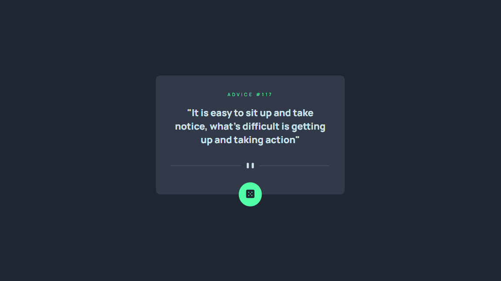
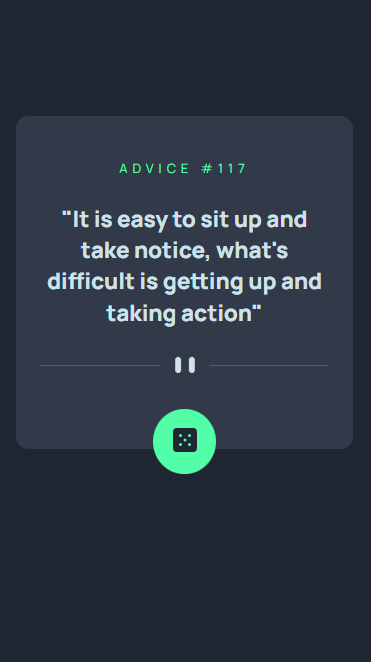

# Frontend Mentor - Advice generator app solution

This is a solution to the [Advice generator app challenge on Frontend Mentor](https://www.frontendmentor.io/challenges/advice-generator-app-QdUG-13db). Frontend Mentor challenges help you improve your coding skills by building realistic projects.

## Table of contents

- [Overview](#overview)
  - [The challenge](#the-challenge)
  - [Screenshot](#screenshot)
  - [Links](#links)
- [My process](#my-process)
  - [Built with](#built-with)
  - [What I learned](#what-i-learned)
  - [Continued development](#continued-development)
- [Author](#author)

## Overview

### The challenge

Users should be able to:

- View the optimal layout for the app depending on their device's screen size
- See hover states for all interactive elements on the page
- Generate a new piece of advice by clicking the dice icon

### Screenshot

#### Screenshot for desktop



#### Screenshot for mobile



### Links

- Solution URL: [https://www.frontendmentor.io/solutions/quote-generator-ebG0iTB9dG](https://www.frontendmentor.io/solutions/quote-generator-ebG0iTB9dG)
- Live Site URL: [quote-generator243.netlify.app/](quote-generator243.netlify.app/)

## My process

### Built with

- Semantic HTML5 markup
- CSS custom properties
- Flexbox
- CSS Grid
- Mobile-first workflow

### What I learned

This project's major task was to fetch data from the adviceslip api. I implemented this using the fetch api like this:

```js
const getQuote = async () => {
  const url = "https://api.adviceslip.com/advice";
  fetch(url).then(response => {
    if(!response.ok) {
      throw new Error(response.status)
    }
    return response.json()
  }).then(data => {
    displayQuote(data.slip.advice, data.slip.id)
  }).catch(error => {
    console.log(error)
  })
}
```

### Continued development

In the future I am either going to submit more projects provided by frontendmentor or I think of my own project ideas. The next project I want to complete is designing a calendar in figma and then build it using react and redux.

## Author
- Frontend Mentor - [@LucaJahnen](https://www.frontendmentor.io/profile/LucaJahnen)
- Twitter - [@LucaJahnen](https://github.com/LucaJahnen)